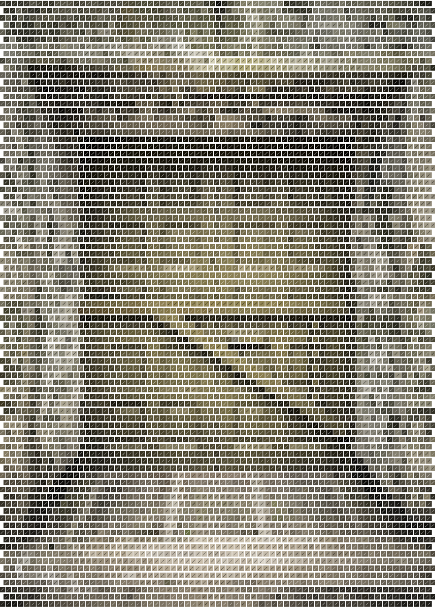
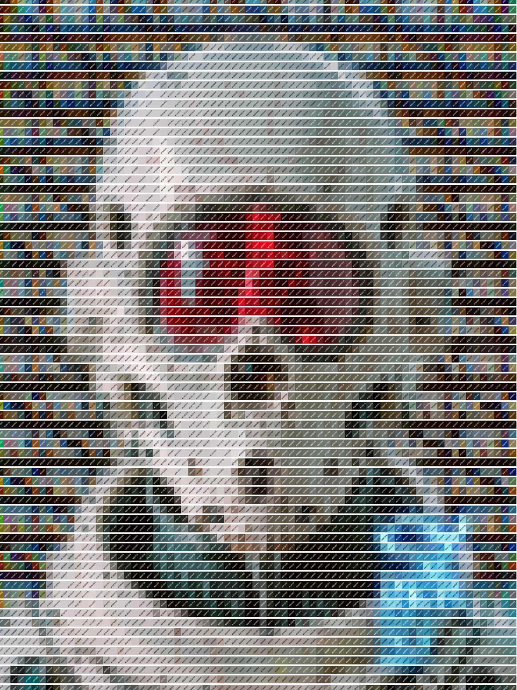

# Paletter - Advanced Grid Color Overlay

A Streamlit application to upload images and overlay them with a customizable grid. Each grid point samples the underlying color, displays a marker, and optionally shows the color value as a label.




## Features

*   **Image Upload:** Upload multiple PNG, JPG, or JPEG images.
*   **Grid Customization:**
    *   Choose between **Rectangular**, **Hexagonal**, or **Triangular** grids.
    *   Adjust the **grid resolution** (cells per axis).
    *   Enable **Adaptive Resolution** to vary grid density based on image variance.
*   **Marker Customization:**
    *   Select marker **shape** (Circle, Square, Diamond, Triangle, Cross).
    *   Adjust marker **radius**.
*   **Label Customization:**
    *   Set **font size**.
    *   Choose **color format** (RGB, HEX, HSL).
    *   Control label **position** relative to the marker (Above, Below, Left, Right, Center).
    *   Fine-tune label position with **X/Y offsets**.
    *   Apply **text rotation**.
    *   Enable **Dynamic Contrast** for text color based on background.
    *   Optionally **avoid overlapping labels**.
*   **Font Upload:** Use a custom `.ttf` font for labels.
*   **Image Resizing:** Option to automatically resize large images to a maximum dimension for faster processing.
*   **Palette Extraction:** Displays the 5 dominant colors found in the sampled grid points using K-Means clustering.
*   **Color Distribution Histogram:** Shows the distribution of color channel intensities from the sampled points.
*   **Presets:**
    *   **Save** current settings configuration as a named preset.
    *   **Load** previously saved presets.
    *   **Import/Export** presets as a `.json` file.
*   **Randomize:** Apply random settings for experimentation.
*   **Download Results:** Download the processed image with the overlay applied as a PNG file.

## Setup

1.  **Clone the repository (or download the files).**
2.  **Install dependencies:**
    Make sure you have Python 3 installed. It's highly recommended to use a virtual environment:

    ```bash
    # Create a virtual environment (optional but recommended)
    python -m venv .venv

    # Activate the virtual environment
    # Windows
    .venv\Scripts\activate
    # macOS/Linux
    source .venv/bin/activate

    # Install required packages
    pip install -r requirements.txt
    ```

## Running the App

Once the dependencies are installed, run the Streamlit app from your terminal:

```bash
streamlit run paletter.py
```

The application should open in your web browser.

## Usage

1.  **Upload Images:** Use the file uploader in the sidebar to select one or more images.
2.  **Adjust Settings:** Configure the grid, marker, label, and processing options in the sidebar.
3.  **Use Presets:** Save, load, import, or export settings configurations using the preset controls.
4.  **Randomize:** Click the "Randomize" button to apply random settings to the uploaded images.
5.  **View Results:** The processed images with overlays will appear in the main area.
6.  **Download:** Click the download button below each processed image to save it. 